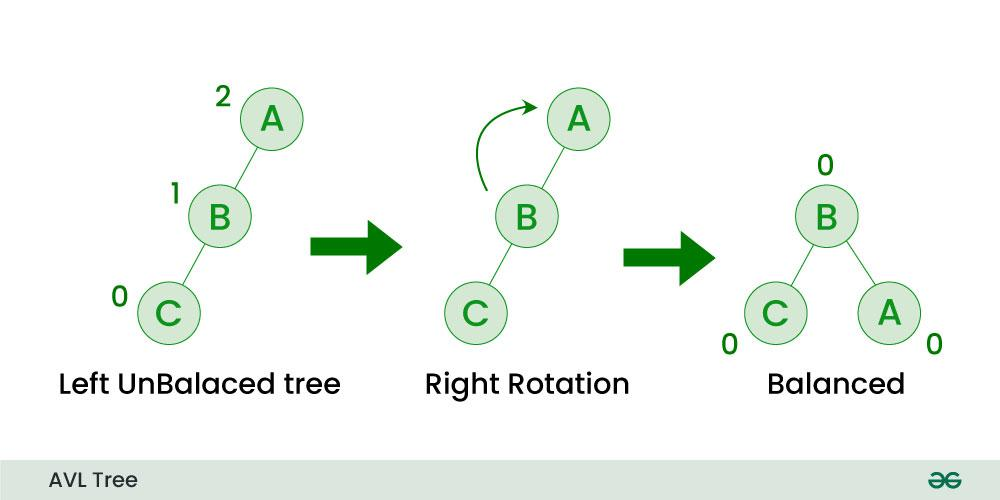

# Árvores AVL

## 1. Comportamento Padrão para Inserção e Balanceamento da Árvore AVL

### Inserção:
- A inserção em uma árvore AVL é semelhante à inserção em uma árvore de busca binária. O elemento a ser inserido é comparado com os nós existentes, descendo pela árvore até encontrar uma posição vazia onde o novo nó pode ser adicionado.
- Após a inserção, a árvore pode perder seu equilíbrio, o que é determinado pela altura dos subárvores esquerda e direita de cada nó.

### Balanceamento:
- O balanceamento de uma árvore AVL é realizado após cada inserção (ou exclusão) para garantir que a diferença entre a altura das subárvores esquerda e direita de qualquer nó não seja maior que 1. Essa diferença é chamada de fator de balanceamento e é calculada como:
  

- Se o fator de balanceamento de um nó se torna 2 ou -2 após uma inserção, a árvore precisa ser reequilibrada. Existem quatro casos principais de desbalanceamento:
  1. **Rotação à direita** 
  2. **Rotação à esquerda** 
  3. **Rotação dupla à direita** 
  4. **Rotação dupla à esquerda** 

Critérios para manter o balanceamento:

- **Altura**: Após cada operação de inserção ou exclusão, o fator de balanceamento de cada nó é verificado para assegurar que se mantenha entre -1 e 1.

- **Rotação**: Dependendo do fator de balanceamento, diferentes tipos de rotações são aplicadas para restaurar o equilíbrio da árvore. A escolha da rotação depende da posição do nó que causou o desbalanceamento.

- **Atualização de Altura**: A altura de cada nó deve ser atualizada após as rotações para refletir a nova estrutura da árvore.

Exemplo de rotacao a esquerda:

  

Exemplo de rotacao a direita:

  

